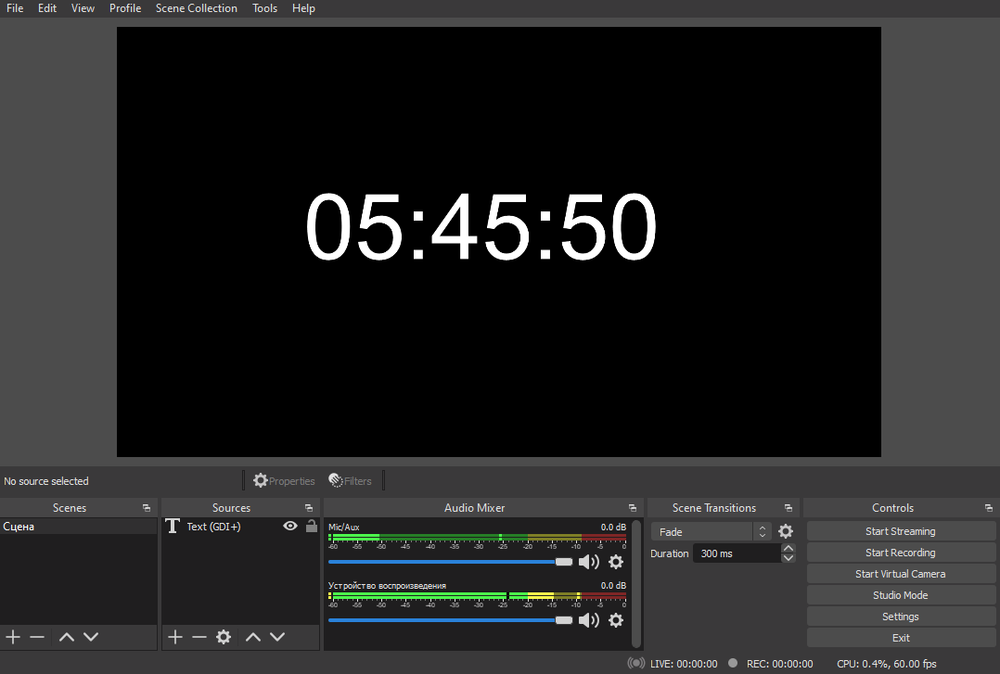

## About The Project

This project is used to display real time

## Example

## Installation

1. Download `realtime_clock.lua`

2. Start Open Broadcast Software (OBS)

3. Add Text (FreeRype 2 or GDI+) to sources

4. Go to Tools->Scripts 

5. Press `+` button and find `realtime_clock.lua` in explorer

6. Select `Text Source` in right part of window

## License

Distributed under the WTFPL License. See `LICENSE` for more information.